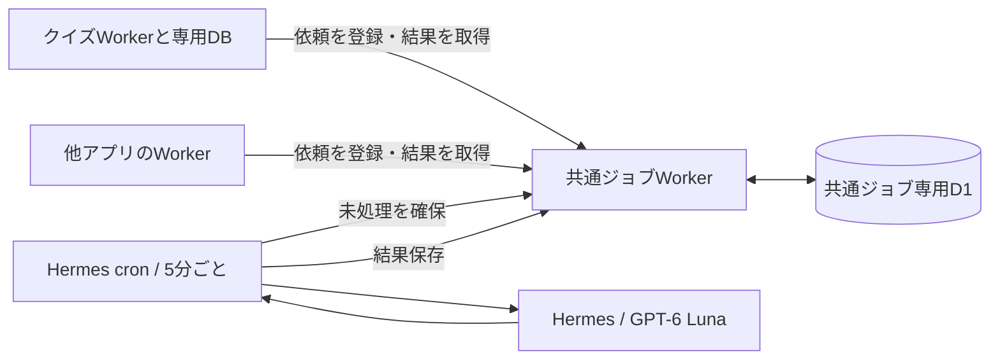

# Hermes LLM Jobs

複数アプリからのLLM処理を受け付ける、独立した非同期ジョブサービスです。

- API: https://hermes-llm-jobs.kazumasa.workers.dev
- Cloudflare Worker: `hermes-llm-jobs`
- D1: `hermes-llm-jobs`（クイズのDBとは別）
- 実行: PC上のHermes Agent / GPT-6 Luna / Codexログイン



## アプリから使う

アプリごとに別のBearerキーを発行し、バックエンドのSecretとして保持します。

```bash
npm ci
python3 provision-app.py my-app --types document.summarize
```

キーは `.private/apps/my-app.json` へ所有者限定で保存され、画面には表示しません。既存アプリIDで再実行するとキーをローテーションします。必要なイベントだけを許可してください。

### 登録

`POST /api/jobs` に `Authorization: Bearer <アプリ用キー>` と `Content-Type: application/json` を付けます。

```json
{
  "type": "document.summarize",
  "version": 1,
  "idempotencyKey": "document-123-v1",
  "payload": {"text": "要約する文章"}
}
```

応答の `id` を保存し、同じアプリ用キーで `GET /api/jobs/{id}` を呼びます。
状態は `pending` / `running` / `completed` / `failed`。完了時の `result` に結果とモデル・指示の版が入ります。他アプリのジョブは取得できません。同じアプリ・同じ重複防止キーで同じ入力を再送すると同じID、入力が違うと409です。

| イベント | payload | result |
|---|---|---|
| quiz.grade / v1 | question, modelAnswer, rubric（3項目）, answer | criteria（各0〜2点と理由）, confidence, feedback |
| document.summarize / v1 | text（最大12,000文字） | summary, keyPoints |

HTTP本文は最大32KiBです。採点基準の文字列などにも個別上限があります。APIの入力・結果形式を `worker.js`、Hermesへの指示・結果検証を `runner.py` で管理しています。任意のコマンド・URL・プロンプトをイベント入力で実行する機能はありません。

## 独立性とクイズとの連携

このリポジトリはクイズのコードをimportせず、クイズのDBへアクセスしません。
クイズは通常のAPIクライアントです。Cloudflare上では別WorkerへのService Bindingで同じHTTP APIを呼び、アプリ用キーでも認証します。他アプリは公開HTTPS APIでも利用できます。

クイズ側の `quiz_job_outbox` に回答と送信待ちを同時保存し、障害後も重複防止キー付きで再送します。完了結果はクイズWorkerが取得し、クイズの点数・講評へ反映します。結果取得はクイズ側の5分ごとのCronと診断画面へのアクセス時に行います。共通サービスからクイズDBを直接更新する処理やWebhookはありません。

## デプロイ

```bash
npm ci
npm run db:remote
npx wrangler secret put JOB_RUNNER_KEY
npm run deploy
```

`wrangler.jsonc` はこの環境のアカウント・専用DBを指定しています。別環境ではWorker名・アカウント・DBとrunnerの許可URLを変更してください。

- `JOB_RUNNER_KEY`: 実行プログラム用の強いランダムキー。
- `llm_apps`: アプリID、キーのSHA-256、許可type、enabledを保存。生キーはDBに保存しません。
- `/health`: サービス識別用の公開ヘルス応答。
- 元のクイズURLの `/api/jobs` は廃止。認証情報を別URLへ転送するリダイレクトは行いません。

## PC側の実行

`.private/config.json` を所有者限定権限で作成します。

```json
{"url":"https://hermes-llm-jobs.kazumasa.workers.dev","runnerKey":"Worker Secretと同じ値"}
```

```bash
python3 runner.py
```

日本時間8:00〜23:59のみ実行し、未処理がなければ無出力で終了してLLMを呼びません。1回最大2件、1件150秒まで。PC内の同時実行はファイルロック、PC間はAPIの10分の処理権で制御します。失敗は5分後に再試行し、3回失敗で `failed` にします。

結果保存が通信に失敗した場合は `.private/result-*.json` に保持した同一結果を再送します。ジョブ取得時点では回答を一括確保しません。障害後にモデル呼び出しが重複する可能性はありますが、結果確定は処理権とDB更新条件で保護します。

`hermes-call.py` はローカルHermesの内部Python APIを使います。空のツールセット、ユーザー設定・ルールを無効にした実行です。Hermes更新で内部APIが変われば対応が必要です。Hermes自身の会話保存方針は適用されます。

## このPCの定期設定

- Hermes cron ID: `6df0ad98fae9` / 「共通LLMジョブ処理」
- 5分間隔。時間帯はrunnerで日本時間に制限
- スクリプト: `~/.hermes/scripts/compass-llm-jobs.py`
- リポジトリ: `/home/kazu/work/hermes-llm-jobs`
- Codexアプリの旧定期採点 `ai` は停止済み

登録はHermesの `--script compass-llm-jobs.py --no-agent` を使います。外側のスケジューラーはLLMを呼ばず、runnerが未処理を見つけたときだけHermesを呼びます。`hermes cron runs` で成功・失敗を確認できます。

## 移行

旧クイズDBのジョブ・アプリ認証は専用DBへコピーし、元テーブルはロールバック用の保管として残しています。現在のクイズの実行コードからは利用しません。秘密鍵、移行スナップショット、処理結果キャッシュは `.private/` 配下でGit対象外です。
