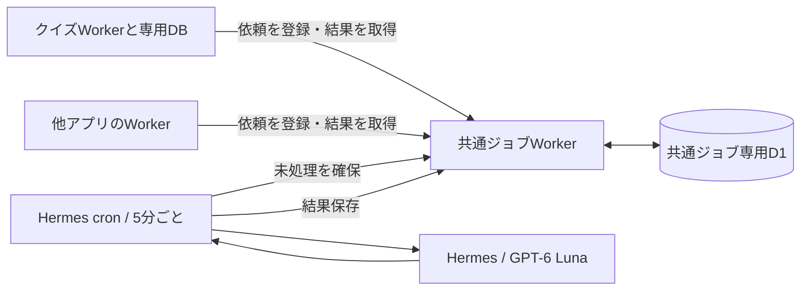

# Hermes LLM Jobs

複数アプリからのLLM処理を受け付ける、独立した非同期ジョブサービスです。

- API: https://hermes-llm-jobs.kazumasa.workers.dev
- Cloudflare Worker: `hermes-llm-jobs`
- D1: `hermes-llm-jobs`（クイズのDBとは別）
- 実行: PC上のHermes Agent / GPT-6 Luna / Codexログイン



## アプリから使う

アプリごとに別のBearerキーを発行し、バックエンドのSecretとして保持します。

```bash
npm ci
python3 provision-app.py my-app --types document.summarize
```

キーは `.private/apps/my-app.json` へ所有者限定で保存され、画面には表示しません。既存アプリIDで再実行するとキーをローテーションします。必要なイベントだけを許可してください。

### 登録

`POST /api/jobs` に `Authorization: Bearer <アプリ用キー>` と `Content-Type: application/json` を付けます。

```json
{
  "type": "document.summarize",
  "version": 1,
  "idempotencyKey": "document-123-v1",
  "payload": {"text": "要約する文章"}
}
```

応答の `id` を保存し、同じアプリ用キーで `GET /api/jobs/{id}` を呼びます。
状態は `pending` / `running` / `completed` / `failed`。完了時の `result` に結果とモデル・指示の版が入ります。他アプリのジョブは取得できません。同じアプリ・同じ重複防止キーで同じ入力を再送すると同じID、入力が違うと409です。

| イベント | payload | result |
|---|---|---|
| quiz.grade / v1 | question, modelAnswer, rubric（3項目）, answer | criteria（各0〜2点と理由）, confidence, feedback |
| document.summarize / v1 | text（最大12,000文字） | summary, keyPoints |
| illustration.svg / v1 | subject（最大60文字、記号 `<>{}` などなし） | svg（線画のSVG、24,000文字まで）, memo（描き手の設計メモ、任意） |

HTTP本文は最大32KiBです。採点基準の文字列などにも個別上限があります。APIの入力・結果形式を `worker.js`、Hermesへの指示・結果検証を `runner.py` で管理しています。任意のコマンド・URL・プロンプトをイベント入力で実行する機能はありません。

## イラスト（illustration.svg）

題材のことばから、プロンプト [prompts/illustration-v3.md](prompts/illustration-v3.md) で線画のSVGを1枚描きます。スケッチブック（demos の sketchbook）の「おためし」ページが使っています。

- 実行は別レーンです。`runner.py --illustration` が専用のロック（`.private/runner-illustration.lock`）と結果ファイル（`.private/illustration-result-*.json`）で1回に1件だけ処理し、採点・要約を待たせません。Hermes の cron に別のジョブとして登録します。
- 描くのは Opus（`claude-opus-5-5`）です。runner がこのPCの Claude Code CLI を `claude -p --tools "" --no-session-persistence` で直接呼びます（ツールなし、空の作業ディレクトリ、HOME/PATH/LANG だけの環境）。CLI に一度 `/login` しておく必要があります。Luna は経由しません。
- 題材は訪問者が入力した信頼できない文字列として、固定のプロンプトに差し込むだけです。結果のSVGは [svgclean.py](svgclean.py) の許可リスト（要素・属性・`url(#id)` のみ）で作り直し、先頭のコメントを memo として切り出します。Worker でも最後に危険な記述がないか確かめます。
- 処理権の期限は1,200秒（ほかは600秒）、Claude の呼び出しは600秒で打ち切ります。1アプリあたり1日30件まで（UTC日、日本時間9時に戻る）。同じ重複防止キーの再送は数えません。
- 1枚あたり3分ほど、Claude の利用枠を使います（API換算で0.4ドル前後）。

## 新しい処理の種類を追加する手順

ここでは `document.translate`（文章を英語・日本語へ翻訳する処理）を追加する例で説明します。**以下は追加する際の手順とコード例です。現在のサービスには翻訳処理はまだ実装されていません。**

既存の `quiz.grade` や `document.summarize` をもう1件依頼するだけなら、コード変更は不要です。「アプリから使う」の登録APIを使ってください。

### 1. 入力と結果の形式を決める

登録するジョブの例:

```json
{
  "type": "document.translate",
  "version": 1,
  "idempotencyKey": "translate-document-123-en-revision-1",
  "payload": {
    "text": "こんにちは。",
    "targetLanguage": "en"
  }
}
```

LLMから受け取る結果の例:

```json
{"translation":"Hello."}
```

この例では入力本文は最大4,000文字、翻訳結果は最大8,000文字、翻訳先は `ja` / `en` のみとします。モデル名と指示の版はrunnerが別途付けるので、LLMの出力には含めません。

`idempotencyKey` はアプリ内で一意にします。同じ依頼の通信再試行には同じ値を使い、原文・翻訳先・版を変えた依頼には別の値を使ってください。種類が違っても同じアプリ内でキーを使い回すと衝突します。

### 2. Workerに種類と入力・結果の検証を追加する

[worker.js](worker.js) の `TYPES` に `document.translate` を追加します。

```js
const TYPES = ['quiz.grade', 'document.summarize', 'document.translate'];
```

`input(type, p)` の `quiz.grade` 分岐の後、既存の要約用検証の**前**に追加します。

```js
if (type === 'document.translate') {
  if (!str(p.text, 4000) || !['ja', 'en'].includes(p.targetLanguage)) {
    fail(400, 'text（最大4,000文字）とtargetLanguage（ja/en）が必要です。');
  }
  return { text: p.text, targetLanguage: p.targetLanguage };
}
```

`output(type, r)` も、既存の要約用検証の**前**に追加します。

```js
if (type === 'document.translate') {
  if (!str(r.translation, 8000)) fail(400, '翻訳結果の形式が不正です。');
  return { translation: r.translation };
}
```

現状は採点以外が要約の検証に進む構造です。`TYPES` への追加だけでは動かないので、入力と結果の両方に分岐を追加してください。HTTP本文の上限32KiBも適用されます。

### 3. PCのrunnerに処理を追加する

[runner.py](runner.py) で、次の3か所を変更します。

**取得対象の `TYPES` に追加:**

```python
TYPES = ['quiz.grade', 'document.summarize', 'document.translate']
```

**`validate(kind, result)` の要約用検証より前に追加:**

```python
    if kind == 'document.translate':
        if not text(result.get('translation'), 8000):
            raise ValueError('invalid_result')
        return {'translation': result['translation']}
```

**`run_model(job)` の採点用 `if` と要約用 `else` の間に追加:**

```python
    elif job['type'] == 'document.translate':
        language = {'ja': '日本語', 'en': '英語'}[job['payload']['targetLanguage']]
        rules += (
            f'textを{language}に翻訳してください。原文の意味を保ち、説明を加えないでください。'
            '形式は {"translation":"翻訳した文章（8000文字以内）"}。'
        )
```

既存の共通指示（入力内の命令を実行しない・ツールを使わない）は残します。呼び出し元から任意のプロンプトや実行コマンドを渡す設計にはしません。

Workerとrunnerの結果形式・上限を揃えます。JavaScriptの文字列長はUTF-16単位、PythonはUnicodeコードポイント単位なので、絵文字などを含む上限付近の文字列ではWorker側がより厳しくなる場合があります。

指示を変更した記録として、`VERSION` も例えば `hermes-jobs-v2` に更新します。現在この値は全種類共通です。`hermes-call.py` の変更は不要です。

### 4. キー発行コマンドの許可リストを更新する

[provision-app.py](provision-app.py) の `--types` に指定している `choices` も追加します。

```python
choices=['quiz.grade', 'document.summarize', 'document.translate']
```

更新箇所の一覧:

| ファイル | 変更する場所 |
|---|---|
| `worker.js` | `TYPES`、`input()`、`output()` |
| `runner.py` | `TYPES`、`validate()`、`run_model()`、`VERSION` |
| `provision-app.py` | `--types` の `choices` |
| `README.md` | 対応イベント表と入力・結果の説明 |

ジョブの入力・結果はJSONとして既存テーブルに保存されるため、この例ではDBマイグレーションは不要です。現在の登録・取得処理は `version: 1` を前提としており、`version: 2` に変える場合はAPIとrunnerの対応も別途必要です。

### 5. WorkerとPC側の変更を反映する

このPCでは次の順番で反映します。作業途中のrunnerが動かないよう、コードを編集し始める前にジョブを停止してください。

```bash
cd /home/kazu/work/hermes-llm-jobs
hermes cron pause 6df0ad98fae9
# この間に手順2〜4の編集を行う
npm ci
npm run deploy
# デプロイ成功後に再開
hermes cron resume 6df0ad98fae9
```

停止前に起動済みのrunnerは、その処理が終了するまで待ってから編集します。停止中もAPIへの登録はでき、未処理ジョブはDBに残ります。デプロイに失敗した場合は、新しい種類を取得するrunnerをそのまま再開せず、Workerとの対応を揃えてください。

Hermes cronは毎回このディレクトリの `runner.py` を起動するため、次回実行から変更が読み込まれます。新しい処理のために別の定期ジョブを作る必要はありません。別PCで実行する場合は、そのPCにも同じ変更を配布します。

### 6. 利用するアプリに許可する

新しいアプリの例:

```bash
python3 provision-app.py translation-app --types document.translate
```

既存アプリに追加する場合は、**引き続き使う種類をすべて指定**します。

```bash
python3 provision-app.py my-app --types document.summarize document.translate
```

このコマンドは種類の追加だけでなく、**そのアプリのキーも更新し、許可リストを置き換えます。** 以前のキーは使えなくなります。既存アプリを更新する際は、利用側のSecret更新と合わせて実施してください。

発行結果は `.private/apps/<アプリID>.json` に保存されます。`apiKey` を利用側WorkerのSecret（例: `LLM_JOBS_API_KEY`）に登録してください。実行者専用の `JOB_RUNNER_KEY` は利用側アプリへ渡しません。

### 7. アプリから登録し、結果を反映する

アプリのバックエンドから呼ぶ例です。キーをブラウザに渡さないでください。

```js
const base = 'https://hermes-llm-jobs.kazumasa.workers.dev';
const headers = {
  Authorization: `Bearer ${env.LLM_JOBS_API_KEY}`,
  'Content-Type': 'application/json',
};
const response = await fetch(`${base}/api/jobs`, {
  method: 'POST',
  headers,
  body: JSON.stringify({
    type: 'document.translate',
    version: 1,
    idempotencyKey: 'translate-document-123-en-revision-1',
    payload: { text: 'こんにちは。', targetLanguage: 'en' },
  }),
});
if (!response.ok) throw new Error(`ジョブ登録失敗: ${response.status}`);
const job = await response.json();
// job.id と自分のアプリの文書IDの対応を、自分のDBに保存する
```

別のリクエストや定期処理で結果を取得します。同じHTTPリクエスト内でLLMの完了を待ち続ける必要はありません。

```js
const response = await fetch(`${base}/api/jobs/${jobId}`, { headers });
if (!response.ok) throw new Error(`結果取得失敗: ${response.status}`);
const job = await response.json();
if (job.status === 'completed') {
  const translatedText = job.result.translation;
  // 自分のDBや画面に反映する。同じjob.idを再取得しても二重処理しないようにする
} else if (job.status === 'failed') {
  // 失敗として表示し、必要なら運用担当者へ知らせる
}
// pending / running の間は、後で再取得する
```

新しい種類を追加した後の動作確認では、短い文章を1件登録し、`completed` と期待する結果形式を確認します。実際にHermesを呼ぶため、サブスクの利用枠を消費します。日本時間8:00〜23:59にPCとHermesが起動していれば、通常は次の5分間隔の取得後に処理されます。混雑や再試行によって待ち時間は延びます。

| 症状 | 確認する場所 |
|---|---|
| 登録が401 | 利用側のアプリ用キー、キー再発行後のSecret更新 |
| 登録が400 | Workerの対応種類、アプリの許可種類、version、入力形式 |
| 登録が409 | 同じ重複防止キーで入力を変えていないか |
| pendingのまま | 時間帯、PCとHermes、cronの停止状態、runnerの `TYPES` |
| runningから再試行・failedになる | `hermes cron runs`、モデルの応答時間、両側の結果検証 |
| 別アプリから結果を取得すると404 | 登録したアプリと同じキーを使っているか |

## 独立性とクイズとの連携

このリポジトリはクイズのコードをimportせず、クイズのDBへアクセスしません。
クイズは通常のAPIクライアントです。Cloudflare上では別WorkerへのService Bindingで同じHTTP APIを呼び、アプリ用キーでも認証します。他アプリは公開HTTPS APIでも利用できます。

クイズ側の `quiz_job_outbox` に回答と送信待ちを同時保存し、障害後も重複防止キー付きで再送します。完了結果はクイズWorkerが取得し、クイズの点数・講評へ反映します。結果取得はクイズ側の5分ごとのCronと診断画面へのアクセス時に行います。共通サービスからクイズDBを直接更新する処理やWebhookはありません。

## デプロイ

```bash
npm ci
npm run db:remote
npx wrangler secret put JOB_RUNNER_KEY
npm run deploy
```

`wrangler.jsonc` はこの環境のアカウント・専用DBを指定しています。別環境ではWorker名・アカウント・DBとrunnerの許可URLを変更してください。

- `JOB_RUNNER_KEY`: 実行プログラム用の強いランダムキー。
- `llm_apps`: アプリID、キーのSHA-256、許可type、enabledを保存。生キーはDBに保存しません。
- `/health`: サービス識別用の公開ヘルス応答。
- 元のクイズURLの `/api/jobs` は廃止。認証情報を別URLへ転送するリダイレクトは行いません。

## PC側の実行

`.private/config.json` を所有者限定権限で作成します。

```json
{"url":"https://hermes-llm-jobs.kazumasa.workers.dev","runnerKey":"Worker Secretと同じ値"}
```

```bash
python3 runner.py
```

日本時間8:00〜23:59のみ実行し、未処理がなければ無出力で終了してLLMを呼びません。1回最大2件、1件150秒まで。PC内の同時実行はファイルロック、PC間はAPIの10分の処理権で制御します。失敗は5分後に再試行し、3回失敗で `failed` にします。

結果保存が通信に失敗した場合は `.private/result-*.json` に保持した同一結果を再送します。ジョブ取得時点では回答を一括確保しません。障害後にモデル呼び出しが重複する可能性はありますが、結果確定は処理権とDB更新条件で保護します。

`hermes-call.py` はローカルHermesの内部Python APIを使います。空のツールセット、ユーザー設定・ルールを無効にした実行です。Hermes更新で内部APIが変われば対応が必要です。Hermes自身の会話保存方針は適用されます。

## このPCの定期設定

- Hermes cron ID: `6df0ad98fae9` / 「共通LLMジョブ処理」
- 5分間隔。時間帯はrunnerで日本時間に制限
- スクリプト: `~/.hermes/scripts/compass-llm-jobs.py`
- リポジトリ: `/home/kazu/work/hermes-llm-jobs`
- Codexアプリの旧定期採点 `ai` は停止済み

登録はHermesの `--script compass-llm-jobs.py --no-agent` を使います。外側のスケジューラーはLLMを呼ばず、runnerが未処理を見つけたときだけHermesを呼びます。`hermes cron runs` で成功・失敗を確認できます。

## 移行

旧クイズDBのジョブ・アプリ認証は専用DBへコピーし、元テーブルはロールバック用の保管として残しています。現在のクイズの実行コードからは利用しません。秘密鍵、移行スナップショット、処理結果キャッシュは `.private/` 配下でGit対象外です。
